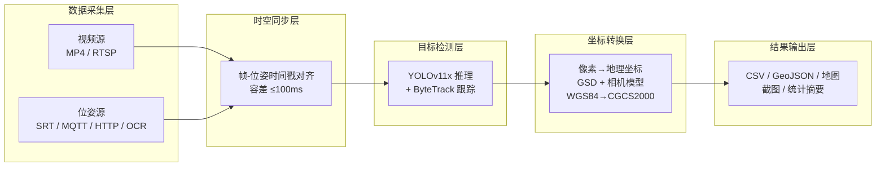
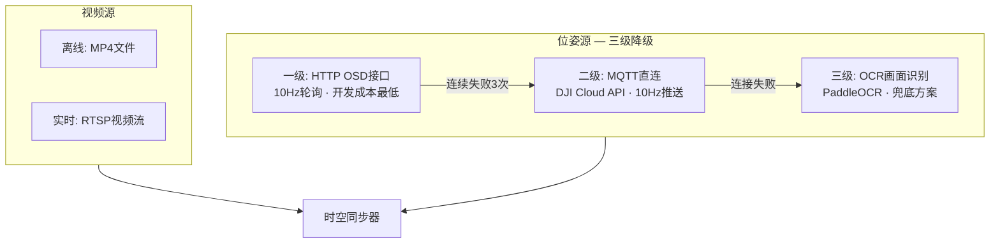
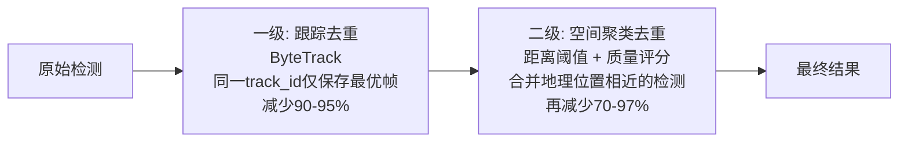

# AI视觉四乱目标检测解决方案 — 标准操作规程（SOP）

> **版本**: v1.0 | **适用场景**: 水利巡检、环保监测、国土执法等无人机AI视觉检测项目

---

## 目录

- [步骤一：系统架构与环境部署](#步骤一系统架构与环境部署)
- [步骤二：数据采集与多源融合](#步骤二数据采集与多源融合)
- [步骤三：模型训练与检测配置](#步骤三模型训练与检测配置)
- [步骤四：检测运行（离线/实时双模式）](#步骤四检测运行离线实时双模式)
- [步骤五：坐标转换与智能去重](#步骤五坐标转换与智能去重)
- [步骤六：结果输出与质量验证](#步骤六结果输出与质量验证)

---

## 步骤一：系统架构与环境部署

### 1.1 总体架构

系统采用五层流水线架构，数据从采集到输出单向流转：

```
数据采集层 → 时空同步层 → 目标检测层 → 坐标转换层 → 结果输出层
```



### 1.2 硬件需求

| 组件 | 最低要求 | 推荐配置 |
|------|---------|---------|
| 无人机 | 支持RTSP推流、可导出SRT/MRK | DJI M3TD / M4TD |
| GPU | NVIDIA GTX 1660（6GB显存） | RTX 3060 及以上（12GB+） |
| 内存 | 16 GB | 32 GB |
| 存储 | SSD 256GB | SSD 512GB+（视频文件较大） |
| 网络 | 百兆局域网 | 千兆（实时模式 RTSP 推流） |

### 1.3 软件栈

```
Python 3.9-3.11
├── ultralytics >=8.3.0          # YOLOv11 推理框架（自动安装 PyTorch）
├── opencv-python >=4.8.0        # 视频/图像处理
├── paddleocr >=2.7.0            # OSD文字识别（备用数据源）
├── pyproj >=3.6.0               # WGS84 → CGCS2000 坐标转换
├── scipy >=1.9.0                # 3D旋转矩阵计算
├── paho-mqtt >=1.6.1,<2.0.0    # MQTT实时通信
├── pandas >=2.0.0               # 数据处理
├── folium >=0.14.0              # 交互式地图生成
├── loguru >=0.7.0               # 日志管理
└── FFmpeg（系统工具）            # SRT字幕轨提取
```

安装命令：

```bash
# 创建虚拟环境
python -m venv venv && source venv/bin/activate  # Linux
python -m venv venv && venv\Scripts\activate      # Windows

# 安装依赖
pip install -r requirements.txt

# 验证GPU可用
python -c "import torch; print(torch.cuda.is_available())"
```

### 1.4 核心配置文件

系统通过 4 个 YAML 文件驱动，位于 `config/` 目录：

| 文件 | 职责 | 关键参数 |
|------|------|---------|
| `yolo_config.yaml` | 模型与检测 | 模型路径、置信度阈值、跟踪器 |
| `camera_params.yaml` | 相机标定与坐标转换 | 焦距、传感器尺寸、GPS质量控制 |
| `offline_config.yaml` | 离线视频处理 | 跳帧数、SRT配置、后处理开关 |
| `realtime_config.yaml` | 实时流处理 | RTSP地址、MQTT/HTTP OSD、降级策略 |

### 1.5 部署验证清单

- [ ] `python -c "import ultralytics; print(ultralytics.__version__)"` 输出 >=8.3.0
- [ ] `python -c "import torch; print(torch.cuda.is_available())"` 输出 `True`
- [ ] `ffmpeg -version` 可正常执行
- [ ] 模型文件 `models/*.pt` 已就位
- [ ] 4个YAML配置文件已根据实际设备参数修改
- [ ] `data/output/` 目录可写

---

## 步骤二：数据采集与多源融合

### 2.1 无人机飞行规范

| 参数 | 推荐值 | 说明 |
|------|-------|------|
| 飞行高度 | 50-120m | 过低视野小、过高目标小 |
| 飞行速度 | 3-8 m/s | 过快导致帧间重叠不足 |
| 相机角度 | -90°（正射） | 倾斜拍摄需启用增强版转换器 |
| 视频分辨率 | 4K（4032×3024） | 高分辨率利于小目标检测 |
| 录制格式 | MP4 + SRT字幕 | 确保GPS数据同步嵌入 |
| GPS模式 | RTK（优先） | RTK精度0.05m，普通GPS约3.5m |

### 2.2 数据源架构

系统支持视频源 + 位姿源双通道采集，位姿源采用三级降级策略保障数据可靠性：



**离线模式数据准备**：将 MP4 视频放入 `data/input/videos/`，系统自动提取同名 SRT 字幕文件并解析 GPS/高度/姿态数据。

**实时模式数据源配置**（`realtime_config.yaml`）：

```yaml
osd_source: "auto"          # auto = HTTP优先，失败降级到MQTT，再降级到OCR

http_osd:
  base_url: "http://服务器地址:端口"
  api_path: "/api/getDrone"
  dev_sn: "设备序列号"
  poll_interval: 0.1         # 10Hz

mqtt:
  broker: "mqtt-cn.dji.com"
  port: 1883
  username: "DJI App Key"
  password: "DJI App Secret"
  topics:
    aircraft_state: "thing/product/{设备SN}/osd"

rtsp:
  url: "rtsp://相机IP:8554/live"
  transport_protocol: "tcp"
  buffer_size: 30
```

### 2.3 时空同步机制

同步器以时间戳为纽带，将视频帧与位姿数据配对：

- **同步策略**: 最近邻匹配（`nearest`）或插值（`interpolate`）
- **容差阈值**: ≤100ms（离线）/ ≤500ms（实时）
- **缓存队列**: 位姿数据维持 100 条滑动窗口
- **未匹配帧**: 可选跳过或使用最近一次有效位姿

---

## 步骤三：模型训练与检测配置

### 3.1 四乱类别体系

四乱检测目标按业务分为四大类，可根据实际需求细分子类：

| 大类 | 含义 | 子类示例 |
|------|------|---------|
| **乱占** | 违法侵占河道/岸线 | 违建厂房、临时棚屋、堆放区、停车场 |
| **乱采** | 非法采砂采矿 | 采砂场、矿坑、裸露开采面 |
| **乱堆** | 违规堆放废弃物 | 垃圾堆、建筑废料、工业废料 |
| **乱建** | 违法建设构筑物 | 住宅、厂房、养殖棚、围墙 |

标注规范：
- 使用 YOLO 格式标注（`class_id cx cy w h`，归一化坐标）
- 每类最少 500 张标注样本，推荐 2000+
- 标注框紧贴目标边界，不留过多空白
- 同一图中多目标需全部标注

### 3.2 训练流程

```bash
# 数据集目录结构
dataset/
├── images/
│   ├── train/    # 训练集（80%）
│   └── val/      # 验证集（20%）
├── labels/
│   ├── train/
│   └── val/
└── dataset.yaml  # 类别定义

# 启动训练
yolo detect train data=dataset.yaml model=yolov11x.pt epochs=100 imgsz=1280 batch=8 device=0
```

关键训练参数：

| 参数 | 推荐值 | 说明 |
|------|-------|------|
| `model` | yolov11x.pt | 大模型精度高，适合离线场景；实时场景可选 yolov11m |
| `imgsz` | 1280 | 无人机图像分辨率高，大输入尺寸提升小目标检测能力 |
| `epochs` | 100-300 | 根据数据量调整，关注验证集mAP收敛情况 |
| `batch` | 4-16 | 受限于显存，12GB显存约可设 batch=8 |

评估指标：mAP@0.5 ≥ 0.70 为合格，≥ 0.85 为优秀。

### 3.3 检测参数配置

`yolo_config.yaml` 核心参数：

```yaml
model:
  path: "./models/yolov11x.pt"
  device: "cuda"
  half_precision: true       # FP16推理，速度翻倍
  obb_mode: false            # true=旋转框（需OBB模型），false=水平框

detection:
  confidence_threshold: 0.5  # 置信度阈值，↑减少误检，↓减少漏检
  iou_threshold: 0.45        # NMS阈值
  imgsz: 1280               # 输入图像尺寸

tracking:
  enabled: true              # 启用ByteTrack跟踪去重
  tracker: "bytetrack.yaml"
  lost_threshold: 30         # 目标丢失判定帧数
  edge_penalty: 0.3          # 边缘目标惩罚（0-1）
  min_track_frames: 3        # 最少出现帧数（过滤闪现误检）
```

**ByteTrack跟踪器参数**（`bytetrack.yaml`）：

```yaml
track_high_thresh: 0.5       # 高置信检测匹配阈值
track_low_thresh: 0.1        # 低置信检测阈值
new_track_thresh: 0.6        # 新建跟踪最低置信度
track_buffer: 30             # 目标消失后保持帧数
match_thresh: 0.8            # IoU匹配阈值
```

### 3.4 HBB vs OBB 模式选择

| 模式 | 适用场景 | 优势 | 限制 |
|------|---------|------|------|
| HBB（水平框） | 正射拍摄、规则目标 | 速度快、模型通用 | 倾斜目标框不紧凑 |
| OBB（旋转框） | 倾斜拍摄、狭长目标 | 框更贴合目标 | 需专门训练OBB模型 |

---

## 步骤四：检测运行（离线/实时双模式）

### 4.1 离线模式

适用于事后分析已录制的巡检视频。

**操作步骤**：

```bash
# 方式一：快捷启动
python run_offline.py "data/input/videos/巡检视频.MP4"

# 方式二：CLI启动（更多控制）
python -m src.main --mode offline --video "data/input/videos/巡检视频.MP4" --config ./config
```

**核心参数**（`offline_config.yaml`）：

```yaml
video_processing:
  frame_skip: 15            # 每15帧处理一次（25fps视频约0.6秒/帧）
  start_frame: 0            # 起始帧
  end_frame: 0              # 0=处理至结束

srt_extraction:
  extract_embedded_srt: true
  ffmpeg_path: "ffmpeg"

data_sync:
  sync_method: "timestamp"
  timestamp_tolerance: 100   # ms
```

**跳帧策略选择**：

| frame_skip | 处理密度 | 适用场景 |
|------------|---------|---------|
| 1 | 每帧处理 | 精细检测，速度慢 |
| 5-10 | 中等密度 | 慢速飞行或需要高召回 |
| 15-30 | 低密度 | 常规巡检，推荐值 |
| 50+ | 极低密度 | 快速概览 |

### 4.2 实时模式

适用于无人机在飞状态下的实时检测。

**启动前检查**：
- [ ] RTSP视频流可访问（`ffplay rtsp://相机IP:8554/live`）
- [ ] OSD数据源至少一个可用（HTTP/MQTT/OCR）
- [ ] GPU驱动正常、模型已加载

**操作步骤**：

```bash
# 启动实时检测
python run_realtime.py

# 运行中按 Ctrl+C 或 Esc 停止，系统自动保存并执行后处理
```

**核心参数**（`realtime_config.yaml`）：

```yaml
realtime_processing:
  frame_skip: 1              # 实时模式建议每帧处理
  enable_multithreading: true
  num_worker_threads: 4

error_handling:
  max_consecutive_failures: 10  # 连续失败10次后停止
  save_error_frames: true       # 保存异常帧用于排查
```

### 4.3 质量评分机制

每个检测目标自动计算质量评分，用于后续去重时选优：

```
quality_score = confidence × edge_factor × (1.0 + area_bonus)

edge_factor = 0.3（边缘目标）| 1.0（非边缘）
area_bonus  = min(目标面积 / 1e6, 0.5)
```

### 4.4 异常处理预案

| 异常场景 | 系统行为 | 人工措施 |
|---------|---------|---------|
| RTSP断流 | 自动重连（无限次） | 检查网络/推流设备 |
| HTTP OSD不可用 | 降级至MQTT | 检查桥接服务状态 |
| MQTT连接失败 | 降级至OCR | 确认App Key/SN配置 |
| OCR识别失败 | 跳过无位姿帧 | 检查OSD区域ROI设置 |
| GPU显存溢出 | 程序报错退出 | 减小 imgsz 或 batch |
| 连续检测失败 | 超过阈值自动停止 | 检查模型文件/输入数据 |

---

## 步骤五：坐标转换与智能去重

### 5.1 像素到地理坐标转换

检测框的像素坐标需转换为地理坐标才具有实际意义。转换依赖无人机飞行高度和相机内参计算地面采样距离（GSD）：

```
GSD = (传感器宽度 × 飞行高度) / (焦距 × 图像宽度)

目标经度 = 无人机经度 + Δx × GSD / (每度经度米数 × cos(纬度))
目标纬度 = 无人机纬度 + Δy × GSD / 每度纬度米数
```

**相机参数配置**（`camera_params.yaml`）：

```yaml
camera:
  model: "DJI_M4TD"
  resolution: { width: 4032, height: 3024 }
  sensor_size: { width: 13.4, height: 9.6 }  # mm
  focal_length: 6.72                           # mm

coordinate_transform:
  use_enhanced: false     # true=增强版（3D姿态修正），false=简化版
  quality_control:
    enabled: true
    min_gps_level: 3      # 最低GPS信号强度
    min_satellite_count: 10
```

**两种转换器对比**：

| 特性 | 简化版 | 增强版 |
|------|-------|-------|
| 适用场景 | 正射拍摄（-90°） | 任意角度拍摄 |
| 姿态修正 | 无 | Roll/Pitch/Yaw 3D旋转矩阵 |
| 精度 | 3-5m | 2-3m（提升60-70%） |
| GPS质量控制 | 无 | 自动过滤低质量定位 |
| 误差估算 | 无 | 输出每个目标的估计误差 |

### 5.2 坐标系转换

```
输入: WGS84 (EPSG:4326) — 无人机GPS原始坐标
输出: CGCS2000 (EPSG:4490) — 中国国家标准

转换精度: < 0.1m（通过 pyproj 库 Transformer 实现）
```

### 5.3 两级智能去重

无人机视频中同一目标会被多帧重复检测，系统通过两级去重消除冗余：



**一级 — 推理阶段跟踪去重**（TrackManager）：
- 使用 ByteTrack 为每个目标分配 `track_id`
- 延迟保存策略：目标在画面中持续跟踪，仅在丢失后保存置信度最高、非边缘的最优帧
- 过滤闪现误检：出现不足 `min_track_frames`（默认3帧）的目标自动丢弃

**二级 — 后处理空间聚类去重**（`deduplication.py`）：
- 基于 Haversine 距离计算地理距离
- 距离 < `distance_threshold`（默认5m）的检测视为同一目标
- 按质量评分取最优：综合考虑置信度、边缘位置、GPS质量

```yaml
# 去重配置
deduplication:
  distance_threshold: 5.0      # 米，同一目标判定距离
  prefer_non_edge: true        # 优先保留画面中央目标
  prefer_high_confidence: true # 优先保留高置信度
  prefer_rtk: true             # 优先保留RTK定位数据
  min_quality_score: 0.3       # 最低质量评分
  edge_penalty: 0.5            # 边缘惩罚系数
```

---

## 步骤六：结果输出与质量验证

### 6.1 输出文件体系

检测完成后自动生成以下文件：

```
data/output/
├── csv/
│   └── detections_offline.csv       # 结构化检测记录（30+字段）
├── geojson/
│   ├── detections_raw.geojson       # 原始全量数据
│   ├── detections_unique.geojson    # 去重后数据（推荐用于GIS）
│   └── detections_high_conf.geojson # 高置信度数据（≥0.7）
├── images/                          # 检测目标截图
├── map.html                         # 交互式Web地图（Leaflet.js）
└── summary.txt                      # 统计摘要报告
```

**CSV核心字段**：

| 字段 | 说明 |
|------|------|
| `class_name` / `confidence` | 类别名称 / 置信度 |
| `center_lat` / `center_lon` | 目标中心GPS坐标（CGCS2000） |
| `corner1~4_lat/lon` | 检测框四角坐标 |
| `drone_lat` / `drone_lon` / `altitude` | 无人机位置与高度 |
| `gps_quality` / `estimated_error` | 定位质量 / 估计误差(m) |
| `is_on_edge` | 是否位于画面边缘 |

**GeoJSON三版本使用场景**：

| 版本 | 数据量 | 适用 |
|------|-------|------|
| `raw` | 最大 | 数据分析、热力图、密度研究 |
| `unique` | 去重后 | **日常GIS存档（推荐）** |
| `high_conf` | 最小 | 应急响应、快速上报 |

### 6.2 GIS系统集成

GeoJSON 文件采用 CGCS2000 坐标系（EPSG:4490），可直接导入主流GIS平台：

- **QGIS**: 拖入 `.geojson` 文件即可显示，支持属性查询、空间分析
- **ArcGIS**: 通过"添加数据"导入，坐标系自动识别
- **在线平台**: 兼容天地图、高德等国内GIS服务

### 6.3 质量验证标准

**检测质量**：

| 指标 | 合格线 | 优秀线 |
|------|-------|-------|
| mAP@0.5 | ≥ 0.70 | ≥ 0.85 |
| 置信度均值 | ≥ 0.55 | ≥ 0.70 |
| 误检率 | < 15% | < 5% |

**定位质量**：

| 指标 | 合格线 | 优秀线 |
|------|-------|-------|
| 坐标偏差 | < 5m | < 3m |
| RTK使用率 | > 50% | > 80% |
| GPS信号强度 | ≥ 3级 | ≥ 4级 |

**去重效果**：

| 指标 | 预期范围 |
|------|---------|
| 跟踪去重压缩率 | 90-95% |
| 空间聚类去重压缩率 | 70-97% |

### 6.4 交付清单

| 序号 | 交付物 | 格式 | 必选 |
|------|-------|------|------|
| 1 | 去重检测报告 | GeoJSON（unique版） | 是 |
| 2 | 交互式地图 | HTML | 是 |
| 3 | 统计摘要 | TXT | 是 |
| 4 | 检测截图 | JPG | 是 |
| 5 | 原始检测数据 | CSV | 否（备查） |
| 6 | 全量GeoJSON | GeoJSON（raw版） | 否（分析用） |
| 7 | 系统运行日志 | TXT | 否（排查用） |

### 6.5 常见问题速查

| 问题 | 排查方向 |
|------|---------|
| 坐标偏移大 | 检查相机焦距/传感器参数、确认GPS模式（RTK优先） |
| 检测漏报多 | 降低 `confidence_threshold`、增大 `imgsz`、补充训练数据 |
| 误检率高 | 提高 `confidence_threshold`、增加负样本训练 |
| 去重后仍有重复 | 增大 `distance_threshold`（如10m） |
| 实时模式卡顿 | 增大 `frame_skip`、使用 `half_precision`、选用轻量模型 |
| GeoJSON为空 | 检查CSV是否有有效坐标数据、确认 `export_geojson: true` |

---

> **文档维护说明**: 本SOP应随模型迭代、设备更换、业务范围扩展同步更新。建议每季度审视一次配置参数的适用性。
