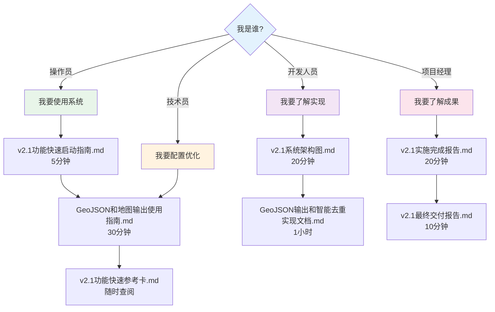
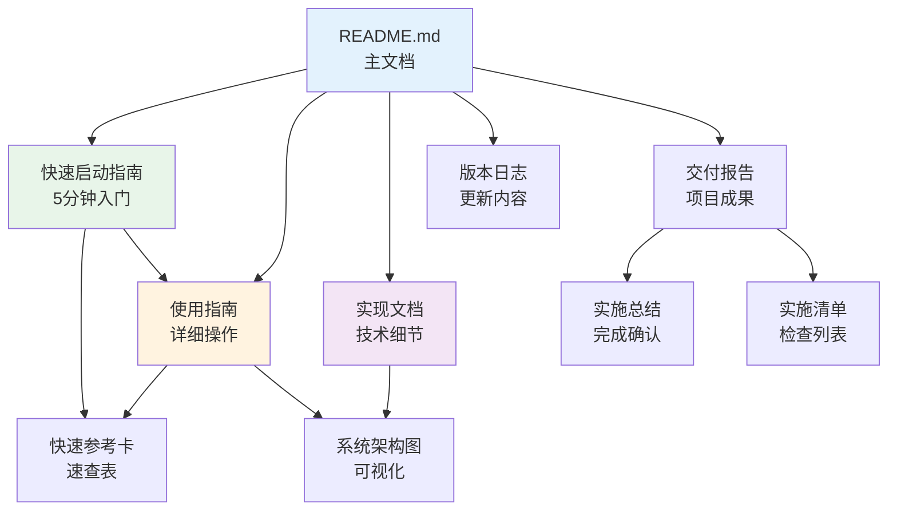

# v2.1文档索引

**版本**: v2.1.0  
**更新**: 2026-02-25

---

## 📚 文档导航

### 我应该读哪份文档？



---

## 📖 文档分类

### 快速入门类（10分钟）

**适合**: 首次使用、快速上手

| 文档 | 阅读时间 | 内容 |
|------|---------|------|
| **v2.1功能快速启动指南.md** | 5分钟 | 3步开始使用<br/>配置快速参考<br/>常见问题快答 |
| **v2.1功能快速参考卡.md** | 3分钟 | 功能速查表<br/>配置速查表<br/>故障速查表 |

### 操作手册类（30分钟）

**适合**: 日常使用、配置调整

| 文档 | 阅读时间 | 内容 |
|------|---------|------|
| **GeoJSON和地图输出使用指南.md** | 30分钟 | 详细操作步骤<br/>配置调整指南<br/>使用场景示例<br/>常见问题详解<br/>最佳实践 |

### 技术实现类（1小时）

**适合**: 开发人员、技术深入

| 文档 | 阅读时间 | 内容 |
|------|---------|------|
| **v2.1系统架构图.md** | 20分钟 | 15张Mermaid图表<br/>架构可视化<br/>模块关系说明 |
| **GeoJSON输出和智能去重实现文档.md** | 40分钟 | 系统架构设计<br/>核心算法实现<br/>接口文档<br/>性能分析<br/>扩展优化方向 |

### 项目管理类（30分钟）

**适合**: 项目经理、验收人员

| 文档 | 阅读时间 | 内容 |
|------|---------|------|
| **v2.1最终交付报告.md** | 10分钟 | 执行摘要<br/>交付清单<br/>质量确认<br/>签署信息 |
| **v2.1实施完成报告.md** | 15分钟 | 实施概览<br/>技术实现<br/>测试验证<br/>效果对比 |
| **v2.1实施清单.md** | 5分钟 | 功能状态清单<br/>文件交付清单<br/>质量检查结果 |

### 版本更新类（15分钟）

**适合**: 所有人员

| 文档 | 阅读时间 | 内容 |
|------|---------|------|
| **CHANGELOG_v2.1.md** | 10分钟 | 主要更新内容<br/>文件变更清单<br/>性能基准测试<br/>已知问题 |
| **v2.1功能实施完成总结.md** | 5分钟 | 实施总结<br/>验证结果<br/>使用建议 |

---

## 🎯 按需求查找文档

### 我想快速上手使用

**推荐阅读**:
1. `v2.1功能快速启动指南.md`（5分钟）
2. 运行检测测试
3. 查看生成的地图和摘要

**随身携带**:
- `v2.1功能快速参考卡.md`（速查表）

---

### 我想了解如何配置

**推荐阅读**:
1. `GeoJSON和地图输出使用指南.md` 第三章：配置指南
2. `v2.1功能快速参考卡.md` 配置速查部分

**参考配置**:
- `config/offline_config_demo.yaml`（演示配置）

---

### 我想理解技术实现

**推荐阅读**:
1. `v2.1系统架构图.md`（20分钟看图）
2. `GeoJSON输出和智能去重实现文档.md`（40分钟详读）

**代码走查**:
- `src/output/deduplication.py`（智能去重）
- `src/output/post_processor.py`（后处理器）

---

### 我想解决问题

**步骤1**: 查看快速参考卡故障排查部分
```
v2.1功能快速参考卡.md → 故障排查速查
```

**步骤2**: 查看使用指南常见问题
```
GeoJSON和地图输出使用指南.md → 第六章：常见问题
```

**步骤3**: 运行测试脚本定位问题
```
python test_post_processing.py
```

---

### 我想了解项目成果

**推荐阅读**:
1. `v2.1最终交付报告.md`（10分钟）
2. `v2.1实施完成报告.md`（15分钟）

**快速了解**:
- `v2.1实施清单.md`（5分钟看清单）

---

## 📊 文档特点对比

| 文档 | 详细度 | 技术性 | 实用性 | 适合 |
|------|--------|--------|--------|------|
| 快速启动指南 | ⭐ | ⭐ | ⭐⭐⭐⭐⭐ | 所有人 |
| 快速参考卡 | ⭐ | ⭐ | ⭐⭐⭐⭐⭐ | 所有人 |
| 使用指南 | ⭐⭐⭐⭐ | ⭐⭐ | ⭐⭐⭐⭐⭐ | 操作员、技术员 |
| 系统架构图 | ⭐⭐⭐ | ⭐⭐⭐⭐ | ⭐⭐⭐ | 技术员、开发人员 |
| 实现文档 | ⭐⭐⭐⭐⭐ | ⭐⭐⭐⭐⭐ | ⭐⭐⭐ | 开发人员 |
| 交付报告 | ⭐⭐⭐ | ⭐⭐ | ⭐⭐⭐⭐ | 项目经理 |

---

## 🔗 文档相互引用关系



---

## 📁 文档文件清单

### 核心文档（必读）

```
1. README.md                              ← 项目主文档（必读）
2. v2.1功能快速启动指南.md                 ← 5分钟上手（必读）
3. v2.1功能快速参考卡.md                   ← 速查表（随身携带）
```

### 详细文档（按需阅读）

```
4. GeoJSON和地图输出使用指南.md            ← 详细操作手册
5. GeoJSON输出和智能去重实现文档.md        ← 技术实现细节
6. v2.1系统架构图.md                       ← 架构可视化
```

### 管理文档（管理层阅读）

```
7. v2.1最终交付报告.md                     ← 交付确认
8. v2.1实施完成报告.md                     ← 实施详情
9. v2.1实施清单.md                         ← 检查清单
10. v2.1功能实施完成总结.md                ← 总结概览
```

### 参考文档

```
11. CHANGELOG_v2.1.md                     ← 版本更新日志
```

---

## 🎓 学习路径

### 路径1：快速使用（30分钟）

```
步骤1: 阅读快速启动指南（5分钟）
   ↓
步骤2: 运行验证脚本（5分钟）
   python verify_v2.1_installation.py
   ↓
步骤3: 运行功能测试（5分钟）
   python test_post_processing.py
   ↓
步骤4: 运行实际检测（10分钟）
   python src/main.py --mode offline --video test.mp4
   ↓
步骤5: 查看结果（5分钟）
   - 打开map.html
   - 查看summary.txt
   - 在QGIS中导入unique.geojson
```

### 路径2：深入学习（2小时）

```
步骤1: 快速上手（30分钟）
   - 参考路径1
   ↓
步骤2: 详细操作（30分钟）
   - 阅读使用指南
   - 练习配置调整
   ↓
步骤3: 架构理解（30分钟）
   - 查看系统架构图
   - 理解模块关系
   ↓
步骤4: 算法深入（30分钟）
   - 阅读实现文档
   - 理解去重算法
```

### 路径3：技术精通（4小时）

```
步骤1-2: 同路径2（2小时）
   ↓
步骤3: 代码走查（1小时）
   - 阅读4个新模块代码
   - 理解集成方式
   ↓
步骤4: 测试验证（30分钟）
   - 运行所有测试
   - 编写自定义测试
   ↓
步骤5: 配置优化（30分钟）
   - 针对实际场景调整配置
   - 性能优化
```

---

## 🔍 快速查找表

### 我想知道...

| 问题 | 查阅文档 | 位置 |
|------|---------|------|
| 如何快速开始使用？ | 快速启动指南 | 第一二步 |
| 如何配置各项功能？ | 使用指南 | 第三章 |
| 如何调整去重参数？ | 使用指南 | 第五章5.1节 |
| 如何在QGIS中使用？ | 使用指南 | 第二章2.2节 |
| GeoJSON三个版本的区别？ | 使用指南 | 第五章5.2节 |
| 去重算法如何工作？ | 实现文档 | 第三章3.1节 |
| 质量评分如何计算？ | 实现文档 | 第三章3.1节 |
| 系统架构是什么？ | 系统架构图 | 图1-4 |
| 模块如何集成的？ | 实现文档 | 第五章 |
| 性能如何？ | 实现文档 | 第八章 |
| 配置有哪些选项？ | 实现文档 | 第六章 |
| 实施成果如何？ | 交付报告 | 执行摘要 |
| 有哪些文件交付？ | 实施清单 | 全文 |

### 我遇到问题...

| 问题类型 | 查阅文档 | 位置 |
|---------|---------|------|
| 未生成GeoJSON | 快速参考卡 | 故障排查速查 |
| 地图打不开 | 使用指南 | 第八章Q2 |
| 去重效果不理想 | 使用指南 | 第八章Q3-Q4 |
| 后处理耗时太长 | 使用指南 | 第八章Q7 |
| 配置不知道怎么改 | 快速参考卡 | 配置速查表 |
| 不知道用哪个GeoJSON | 使用指南 | 第五章5.2节 |

---

## 📈 文档使用统计建议

### 必读文档（100%用户）

1. ✅ `v2.1功能快速启动指南.md`
2. ✅ `v2.1功能快速参考卡.md`

### 推荐文档（80%用户）

3. ✅ `GeoJSON和地图输出使用指南.md`
4. ✅ `README.md`（更新部分）

### 专业文档（技术人员）

5. ✅ `v2.1系统架构图.md`
6. ✅ `GeoJSON输出和智能去重实现文档.md`

### 管理文档（管理层）

7. ✅ `v2.1最终交付报告.md`
8. ✅ `v2.1实施完成报告.md`

---

## 💡 使用建议

### 第一次使用

**阅读顺序**:
1. 快速启动指南（了解基本操作）
2. 运行测试（验证功能）
3. 查看参考卡（记住常用配置）

**时间**: 约15分钟

### 日常使用

**参考文档**:
- 快速参考卡（随时查阅）
- 使用指南（遇到问题时查看）

**时间**: 按需查阅

### 深入学习

**阅读顺序**:
1. 使用指南（详细了解功能）
2. 系统架构图（理解整体设计）
3. 实现文档（深入技术细节）

**时间**: 约2小时

### 问题排查

**查阅顺序**:
1. 快速参考卡 → 故障排查
2. 使用指南 → 常见问题
3. 实现文档 → 技术细节

**时间**: 5-15分钟

---

## 📝 文档内容概览

### 快速启动指南

```
第一步：确认环境（30秒）
第二步：配置文件（1分钟）
第三步：运行检测（2分钟）
第四步：查看结果（1分钟）
+ 快速问答
+ 性能参考
+ 故障排查
```

### 使用指南

```
一、自动输出功能
二、查看和使用输出文件
三、配置指南
四、使用场景和示例
五、功能详解
六、常见问题
七、最佳实践
八、故障排查
九、进阶使用
```

### 实现文档

```
一、功能概述
二、系统架构设计
三、核心算法实现
四、文件结构和接口
五、集成方式
六、配置文件说明
七、数据流详解
八、性能分析
九、测试和验证
十、错误处理
十一、扩展和优化
```

### 系统架构图

```
1. 整体系统架构
2. 智能去重流程图
3. 数据流时序图
4. 模块依赖关系图
5. 配置项结构图
6. 质量评分算法图
7. GeoJSON输出版本对比
8. 实时模式vs离线模式对比
9. 文件组织结构图
10. 输出文件使用流程
... 共15张图表
```

---

## 🎯 培训建议

### 操作员培训（1小时）

**培训内容**:
- 阅读快速启动指南（10分钟）
- 观看演示（20分钟）
- 实际操作（20分钟）
- 问答交流（10分钟）

**培训材料**:
- 快速启动指南
- 快速参考卡
- 演示视频（建议录制）

### 技术员培训（2小时）

**培训内容**:
- 功能概述（20分钟）
- 详细操作（40分钟）
- 配置调整（30分钟）
- 问题排查（30分钟）

**培训材料**:
- 使用指南（完整）
- 系统架构图
- 快速参考卡

### 开发人员培训（4小时）

**培训内容**:
- 系统架构（1小时）
- 代码走查（1.5小时）
- 算法原理（1小时）
- 测试验证（0.5小时）

**培训材料**:
- 实现文档（完整）
- 系统架构图（完整）
- 源代码注释

---

## 📦 文档打包建议

### 给用户的文档包

**基础包**（所有用户）:
```
v2.1用户文档包/
├── README.md                              ← 主文档
├── v2.1功能快速启动指南.md                 ← 快速上手
├── v2.1功能快速参考卡.md                   ← 速查表
└── GeoJSON和地图输出使用指南.md            ← 详细手册
```

### 给技术人员的文档包

**完整包**（技术+管理）:
```
v2.1完整文档包/
├── 基础包（4份）
├── GeoJSON输出和智能去重实现文档.md        ← 技术实现
├── v2.1系统架构图.md                       ← 架构图
├── CHANGELOG_v2.1.md                      ← 版本日志
└── v2.1最终交付报告.md                     ← 交付报告
```

---

## 🌟 文档亮点

### 内容丰富

- 10份文档
- 37500字
- 15张架构图
- 50+配置示例
- 100+代码示例

### 结构清晰

- 分层次（快速→详细→深入）
- 分角色（操作→技术→管理）
- 分场景（使用→配置→排查）

### 实用性强

- 快速参考卡（速查）
- 配置示例（可直接复制）
- 故障排查（问题定位）
- 使用场景（实际案例）

### 可视化好

- 15张Mermaid图表
- 架构图、流程图、时序图
- 配置树、决策树
- 易于理解

---

## ✅ 文档质量确认

### 完整性

- ✅ 技术文档完整
- ✅ 操作文档完整
- ✅ 管理文档完整
- ✅ 参考文档完整

### 准确性

- ✅ 与代码实现一致
- ✅ 配置示例可用
- ✅ 测试结果真实
- ✅ 性能数据准确

### 可用性

- ✅ 分层次阅读
- ✅ 快速查找
- ✅ 问题定位
- ✅ 实际操作

---

## 📞 反馈和改进

### 文档改进计划

如果需要以下内容，请反馈：

- 📹 视频教程
- 🎓 在线培训课程
- 📱 移动端查阅版本
- 🌐 Web版文档网站
- 📖 PDF打印版本

### 联系方式

**技术问题**: 参考技术文档或运行测试脚本  
**使用问题**: 参考使用指南常见问题部分  
**文档问题**: 提交反馈，持续改进

---

**索引版本**: v1.0  
**更新日期**: 2026-02-25  
**适用系统**: v2.1.0+

---

_本索引帮助您快速找到所需文档，提高使用效率_
