# v2.1系统架构图

**版本**: v2.1.0  
**更新**: 2026-02-25

---

## 1. 整体系统架构

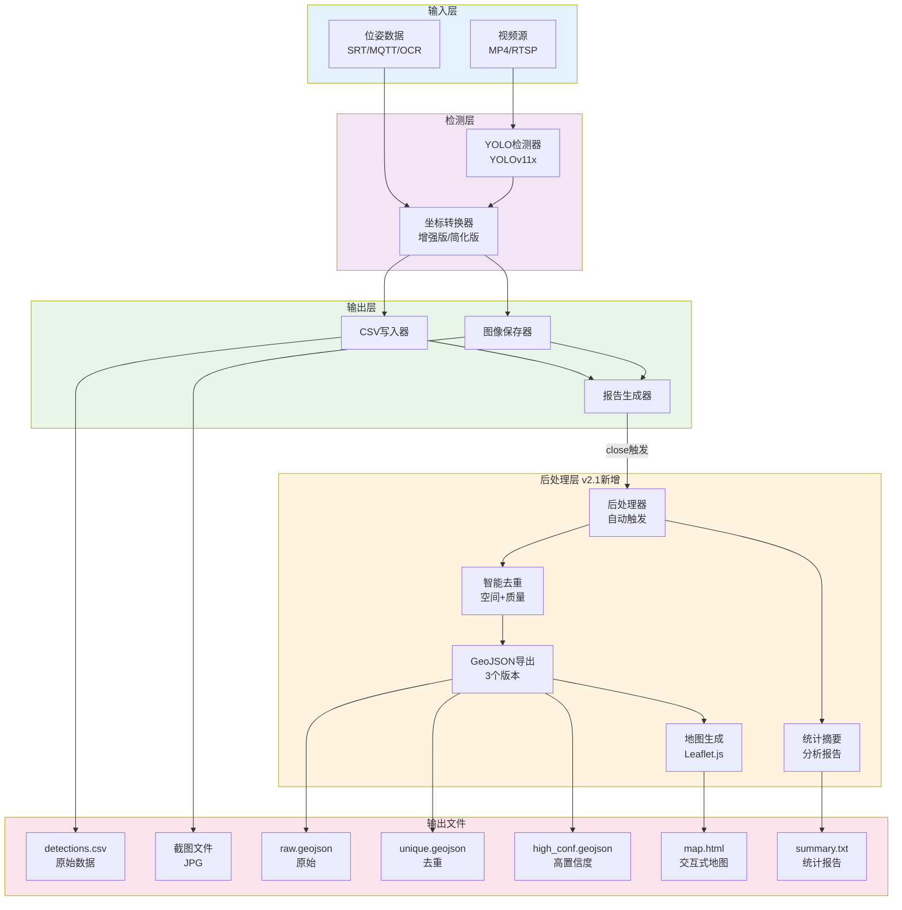

---

## 2. 智能去重流程图

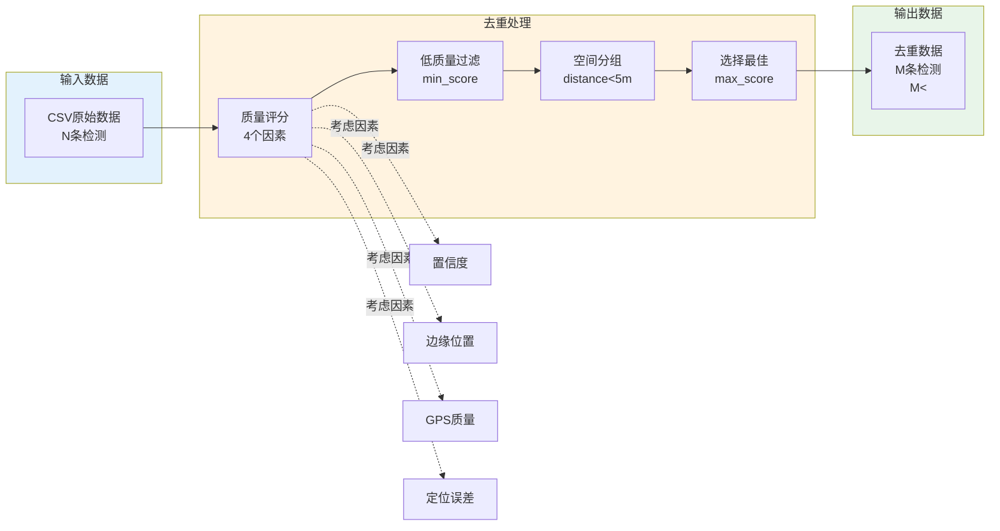

---

## 3. 数据流时序图

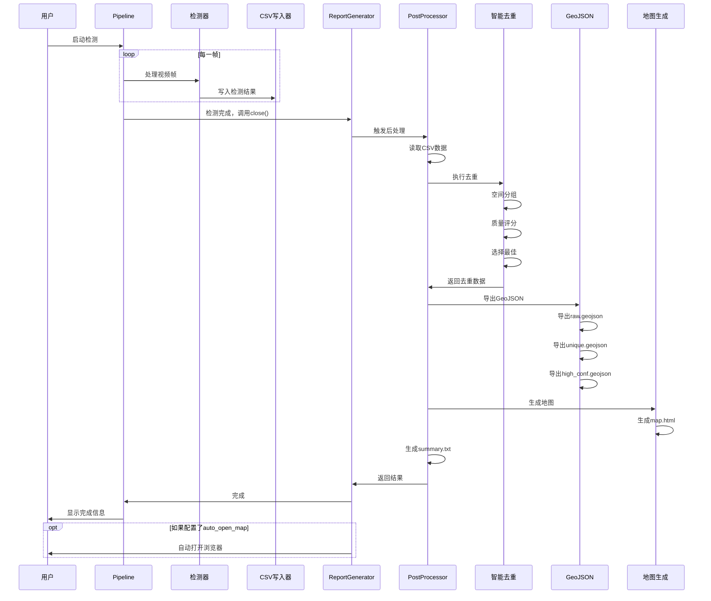

---

## 4. 模块依赖关系图

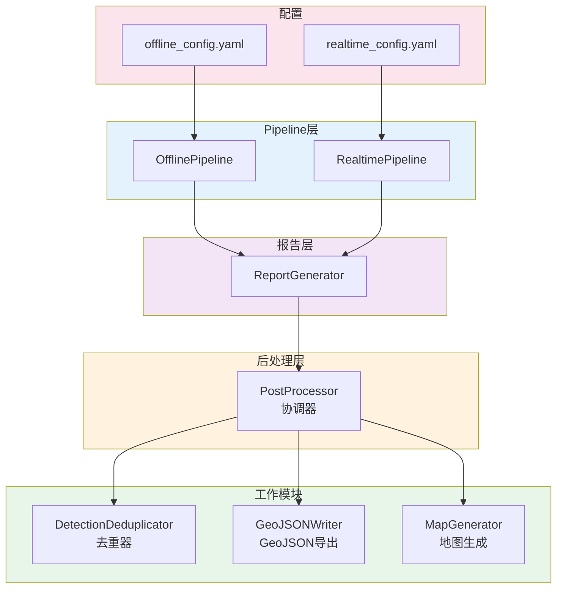

---

## 5. 配置项结构图

```mermaid
graph TB
    subgraph config_file [offline_config.yaml / realtime_config.yaml]
        Output[output节]
    end
    
    subgraph geojson_config [GeoJSON配置]
        GeoSwitch[export_geojson]
        GeoDir[geojson_dir]
        GeoMinConf[geojson_min_confidence]
        GeoHighConf[geojson_high_confidence]
    end
    
    subgraph dedup_config [去重配置]
        DedupSwitch[enable_deduplication]
        DedupSub[deduplication]
        
        DedupDist[distance_threshold]
        DedupEdge[prefer_non_edge]
        DedupRTK[prefer_rtk]
        DedupScore[min_quality_score]
        DedupPenalty[edge_penalty]
    end
    
    subgraph map_config [地图配置]
        MapSwitch[generate_map]
        MapPath[map_output_path]
        MapAuto[auto_open_map]
    end
    
    subgraph summary_config [摘要配置]
        SumSwitch[generate_summary]
        SumPath[summary_path]
    end
    
    Output --> GeoSwitch
    Output --> GeoDir
    Output --> GeoMinConf
    Output --> GeoHighConf
    
    Output --> DedupSwitch
    Output --> DedupSub
    DedupSub --> DedupDist
    DedupSub --> DedupEdge
    DedupSub --> DedupRTK
    DedupSub --> DedupScore
    DedupSub --> DedupPenalty
    
    Output --> MapSwitch
    Output --> MapPath
    Output --> MapAuto
    
    Output --> SumSwitch
    Output --> SumPath
    
    style config_file fill:#e3f2fd
    style geojson_config fill:#e8f5e9
    style dedup_config fill:#fff3e0
    style map_config fill:#f3e5f5
    style summary_config fill:#fce4ec
```

---

## 6. 质量评分算法图

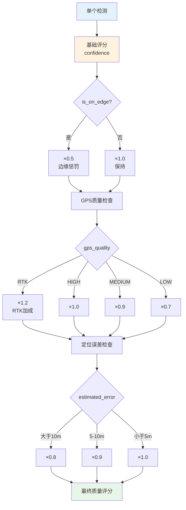

---

## 7. GeoJSON输出版本对比

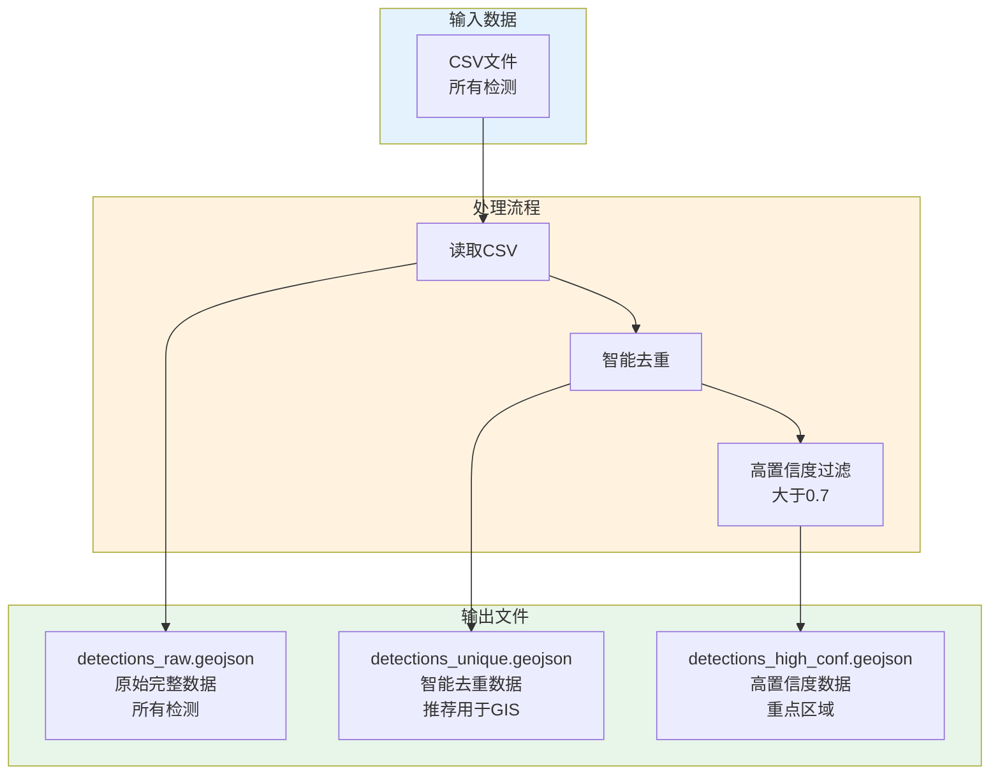

---

## 8. 实时模式 vs 离线模式对比

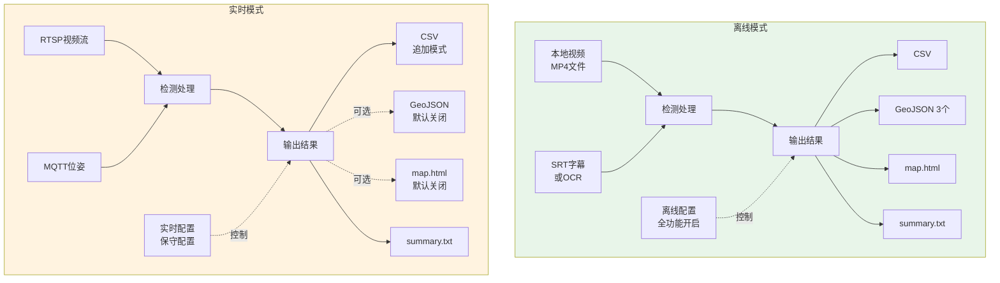

---

## 9. 文件组织结构图

```mermaid
graph TB
    Root[项目根目录]
    
    Root --> Src[src/]
    Root --> Config[config/]
    Root --> Data[data/]
    Root --> Docs[文档]
    Root --> Tests[测试]
    
    Src --> Input[input/<br/>输入层]
    Src --> Detection[detection/<br/>检测层]
    Src --> Transform[transform/<br/>转换层]
    Src --> Output[output/<br/>输出层]
    
    Output --> CSVMod[csv_writer.py]
    Output --> ImgMod[image_saver.py]
    Output --> RepMod[report_generator.py]
    Output --> DedupMod[deduplication.py<br/>v2.1]
    Output --> GeoMod[geojson_writer.py<br/>v2.1]
    Output --> MapMod[map_generator.py<br/>v2.1]
    Output --> PostMod[post_processor.py<br/>v2.1]
    
    Config --> CamConf[camera_params.yaml]
    Config --> YoloConf[yolo_config.yaml]
    Config --> OffConf[offline_config.yaml<br/>v2.1更新]
    Config --> RealConf[realtime_config.yaml<br/>v2.1更新]
    
    Data --> DataOut[output/]
    DataOut --> CSVD[csv/]
    DataOut --> ImgD[images/]
    DataOut --> GeoD[geojson/<br/>v2.1新增]
    DataOut --> MapF[map.html<br/>v2.1新增]
    DataOut --> SumF[summary.txt<br/>v2.1新增]
    
    Docs --> Doc1[GeoJSON输出和智能去重实现文档.md]
    Docs --> Doc2[GeoJSON和地图输出使用指南.md]
    Docs --> Doc3[v2.1功能快速启动指南.md]
    
    Tests --> Test1[test_post_processing.py]
    Tests --> Test2[verify_v2.1_installation.py]
    
    style Src fill:#e3f2fd
    style Output fill:#fff3e0
    style DedupMod fill:#ffeb3b
    style GeoMod fill:#ffeb3b
    style MapMod fill:#ffeb3b
    style PostMod fill:#ffeb3b
```

---

## 10. 质量评分示例流程

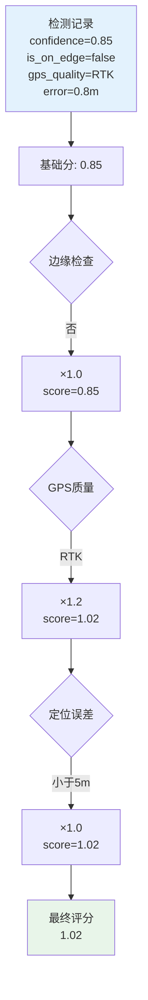

---

## 11. 后处理触发机制

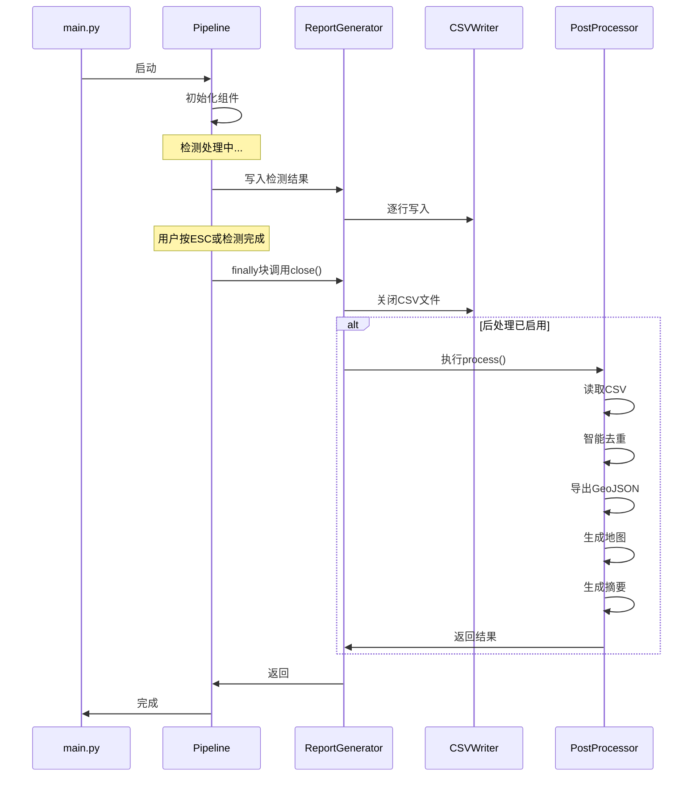

---

## 12. 配置优先级决策树

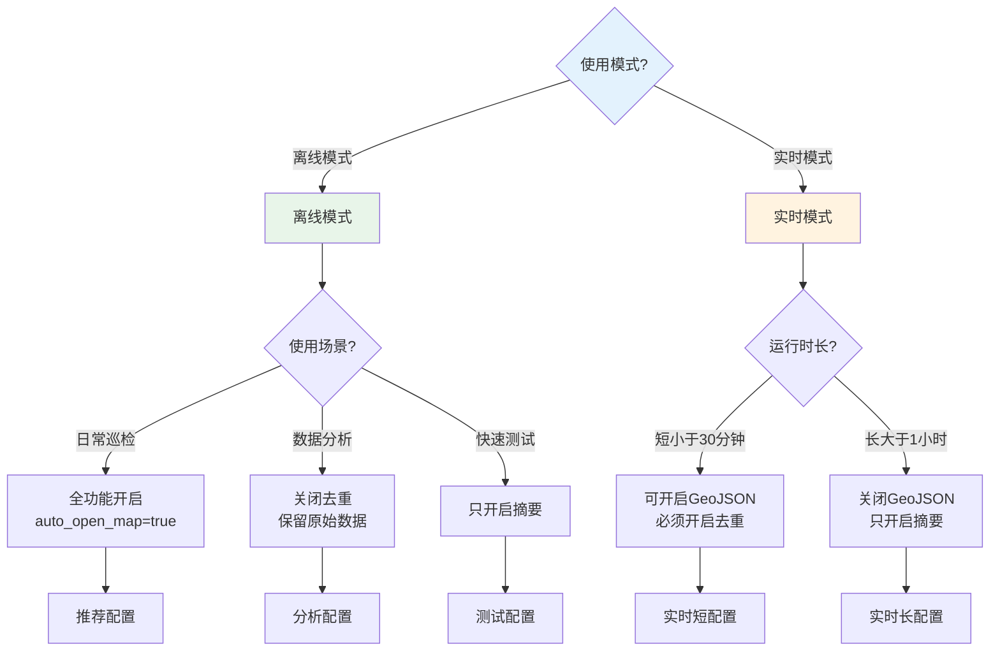

---

## 13. 输出文件使用流程

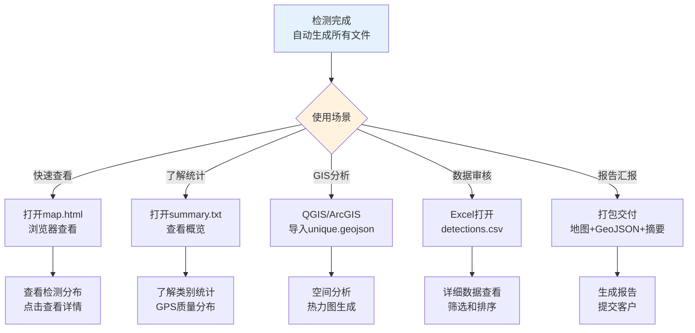

---

## 14. 技术栈层次图

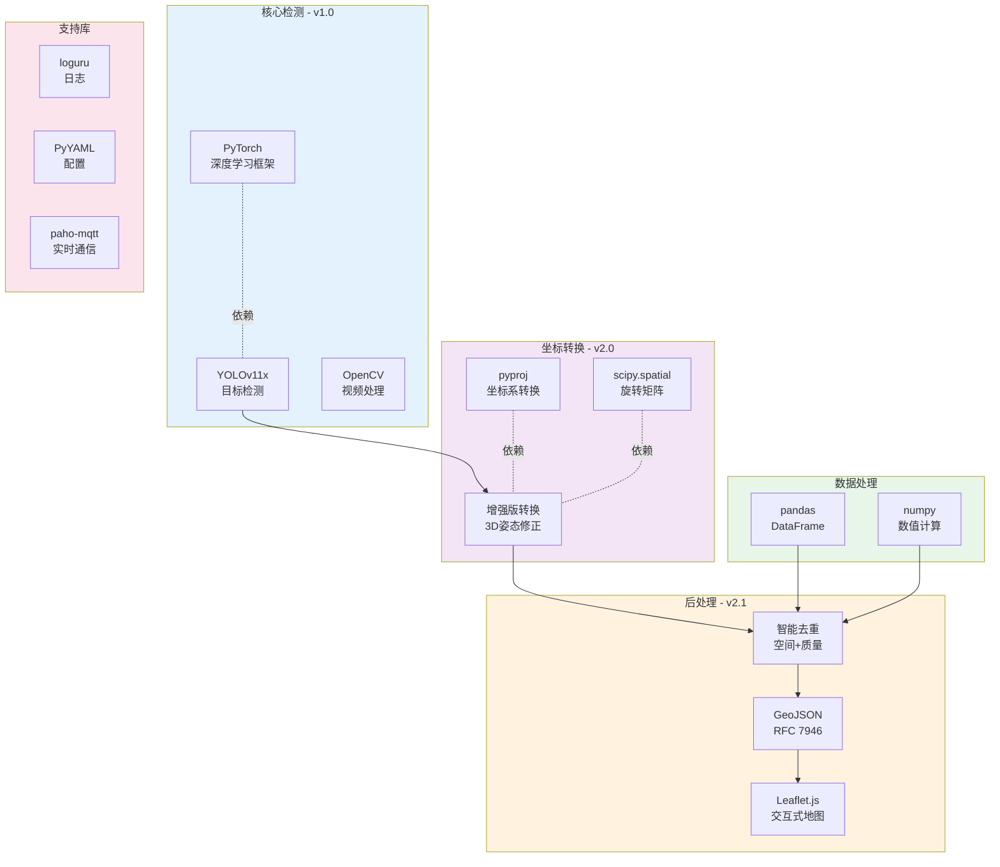

---

## 15. 数据转换流程图

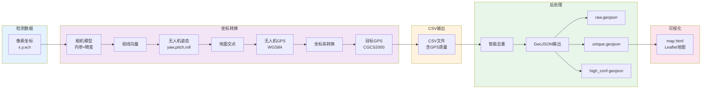

---

## 使用说明

### 如何阅读这些图表

1. **整体架构图**：了解系统整体结构
2. **智能去重流程图**：理解去重工作原理
3. **数据流时序图**：了解执行时序
4. **模块依赖关系图**：理解模块之间的关系
5. **配置项结构图**：了解配置文件结构
6. **质量评分算法图**：理解评分计算过程
7. **GeoJSON输出版本对比**：理解3个版本的差异
8. **模式对比图**：理解离线和实时模式的差异
9. **文件组织结构图**：了解文件布局
10. **输出文件使用流程**：了解如何使用输出文件

### 图表阅读顺序

**快速了解**（10分钟）：
1. 整体架构图
2. 智能去重流程图
3. 输出文件使用流程

**深入理解**（30分钟）：
4. 数据流时序图
5. 模块依赖关系图
6. 质量评分算法图

**配置指导**（10分钟）：
7. 配置项结构图
8. 配置优先级决策树
9. 模式对比图

---

## 配合文档使用

本架构图配合以下文档使用效果最佳：

- 📘 **技术实现**: `GeoJSON输出和智能去重实现文档.md`
- 📗 **操作手册**: `GeoJSON和地图输出使用指南.md`
- 📙 **快速指南**: `v2.1功能快速启动指南.md`

---

**创建时间**: 2026-02-25  
**适用版本**: v2.1.0+  
**文档类型**: 架构参考
