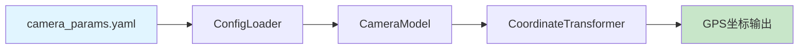

# 相机参数配置说明

## 配置文件的作用

`config/camera_params.yaml` 文件中的参数**确实会被使用**，它们是坐标转换算法的核心参数。

### 工作流程



### 参数如何被使用

1. **程序启动时**
   - Pipeline 加载 `config/camera_params.yaml`
   - 传递给 `CameraModel` 类初始化

2. **坐标转换时**
   - 使用配置的参数计算 GSD（地面分辨率）
   - GSD = (传感器尺寸 × 飞行高度) / (焦距 × 图像分辨率)
   - 基于 GSD 将像素偏移转换为地面距离

3. **输出结果**
   - GPS 坐标的精度直接受这些参数影响

---

## 参数影响示例

### 示例1：分辨率错误的影响

假设实际相机是 4032×3024，但配置文件写成了 5472×3648：

| 项目 | 正确配置 | 错误配置 | 影响 |
|------|---------|---------|------|
| 分辨率 | 4032×3024 | 5472×3648 | |
| GSD (100m高度) | 0.0324 m/px | 0.0238 m/px | **-27%** |
| 100像素目标 | 3.24米 | 2.38米 | **定位偏差0.86米** |
| 1000像素目标 | 32.4米 | 23.8米 | **定位偏差8.6米** |

**结论**：分辨率配置错误会导致**所有坐标系统性偏差**！

### 示例2：焦距错误的影响

假设实际焦距是 7.0mm，但配置文件写成了 8.8mm：

| 项目 | 正确配置 | 错误配置 | 影响 |
|------|---------|---------|------|
| 焦距 | 7.0mm | 8.8mm | |
| GSD (100m高度) | 0.0464 m/px | 0.0369 m/px | **-20%** |
| 定位偏差 | 基准 | 每100米高度偏差约20% | **严重！** |

---

## 验证配置正确性

### 方法1：运行验证脚本

```bash
python verify_camera_config.py
```

此脚本会：
- ✓ 显示配置文件中的参数
- ✓ 显示实际使用的参数
- ✓ 验证两者是否一致
- ✓ 演示参数如何影响坐标转换

### 方法2：查看日志输出

运行检测时，查看日志输出：

```
[INFO] 相机模型初始化完成: DJI_M4TD
[INFO] 分辨率: 4032x3024
[INFO] 传感器尺寸: 13.4x9.6mm
[INFO] 焦距: 7.0mm
[INFO] ✓ 相机参数验证通过
```

如果看到警告信息，说明参数可能有问题：

```
[WARNING] 相机参数验证发现问题:
[WARNING]   ⚠️ 主点X坐标超出图像范围: cx=2736, width=2000
[WARNING] 请检查 config/camera_params.yaml 配置文件!
```

### 方法3：使用已知地标验证

1. 在检测结果中找到已知地标（如建筑物角点）
2. 对比检测坐标与真实坐标
3. 如果误差>10米，检查相机参数配置

---

## 常见问题

### Q1: 我修改了配置文件，为什么没有生效？

**A**: 检查以下几点：
- ✓ 配置文件路径正确：`config/camera_params.yaml`
- ✓ YAML 格式正确（注意缩进）
- ✓ 重新启动了程序（配置在程序启动时加载）
- ✓ 没有指定其他配置目录

### Q2: 代码中的默认值是什么作用？

**A**: 默认值的作用：
- 当配置文件读取失败时使用
- 作为参数缺失时的后备值
- v2.0已将默认值与配置文件同步

### Q3: 如何获取准确的相机参数？

**A**: 三种方法：

**方法1：从照片EXIF获取**
```bash
# 使用exiftool
exiftool photo.jpg | grep -E "Focal|Width|Height"

# 输出示例：
# Image Width: 4032
# Image Height: 3024
# Focal Length: 7.0 mm
```

**方法2：查询官方规格**
- 访问 DJI 官网
- 查看相机型号规格书
- 注意区分照片分辨率和视频分辨率

**方法3：使用标定工具**（高精度需求）
- 拍摄标定板
- 使用 OpenCV 相机标定工具
- 获取完整内参矩阵

### Q4: 不同模式需要不同的参数吗？

**A**: 需要注意：

| 模式 | 分辨率参数 | 说明 |
|------|----------|------|
| 离线视频 | 视频分辨率 | 从视频文件获取实际分辨率 |
| 实时RTSP | RTSP流分辨率 | 可能与照片分辨率不同！ |
| 正射图像 | 照片分辨率 | 使用照片原始分辨率 |

**重要**：实时模式下，RTSP流的分辨率可能是 1920×1080，而不是照片的 4032×3024。需要根据实际情况调整配置。

---

## 配置文件结构

```yaml
camera:
  model: "DJI_M4TD"              # 相机型号（记录用）
  
  resolution:                    # ⭐ 关键：必须与实际分辨率一致
    width: 4032                  # 图像宽度（像素）
    height: 3024                 # 图像高度（像素）
  
  sensor_size:                   # ⭐ 关键：影响GSD计算
    width: 13.4                  # 传感器宽度（毫米）
    height: 9.6                  # 传感器高度（毫米）
  
  focal_length: 7.0              # ⭐ 关键：影响GSD计算
  
  principal_point:               # 光学中心（通常为图像中心）
    cx: 2016                     # width / 2
    cy: 1512                     # height / 2
  
  distortion:                    # 畸变系数（高精度需求才需要）
    k1: 0.0
    k2: 0.0
    p1: 0.0
    p2: 0.0
    k3: 0.0
```

**优先级**：
1. **最重要**: resolution, sensor_size, focal_length
2. **推荐配置**: principal_point
3. **可选**: distortion（大多数情况可忽略）

---

## 修改配置的步骤

### 步骤1：确定需要修改的参数

例如：发现实际使用的是 1920×1080 的RTSP视频流

### 步骤2：编辑配置文件

```bash
# 编辑配置文件
notepad config\camera_params.yaml

# 或在 VSCode 中打开
code config\camera_params.yaml
```

### 步骤3：修改参数

```yaml
resolution:
  width: 1920   # 改为RTSP实际分辨率
  height: 1080

principal_point:
  cx: 960      # width / 2
  cy: 540      # height / 2
```

### 步骤4：验证修改

```bash
# 运行验证脚本
python verify_camera_config.py

# 查看输出确认参数已更新
```

### 步骤5：重新运行检测

```bash
# 实时模式
python run_realtime.py

# 或离线模式
python run_offline.py "video.mp4"
```

---

## 总结

1. ✅ **配置文件确实有用** - 所有参数都会被加载和使用
2. ✅ **参数影响精度** - 错误配置会导致定位偏差
3. ✅ **无需改代码** - 修改配置文件即可生效
4. ✅ **有验证工具** - 可以验证配置是否正确
5. ⚠️ **必须准确** - 参数必须与实际相机一致

**记住**：相机参数配置是整个坐标转换系统的基础，花时间确保参数准确是值得的！
